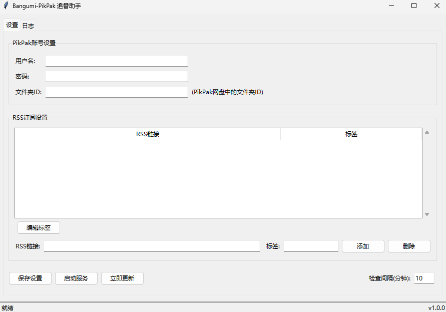

# 项目说明

    
    

---

本项目是基于 [Mikan Project](https://mikanani.me)、[PikPak](https://mypikpak.com/) 的全自动追番整理下载工具。只需要在 [Mikan Project](https://mikanani.me) 上订阅番剧，就可以全自动追番，主要供自己使用。本项目在原有基础上主要添加了UI，使订阅管理更加方便。

## 功能特点

- 全自动追番：自动监控RSS更新，下载最新番剧
- 多RSS订阅：支持添加多个RSS订阅源
- 标签管理：为不同RSS源添加自定义标签，方便分类管理
- 实时日志：提供详细的操作和下载日志
- 本地缓存：自动保存下载的种子文件，避免重复下载
- 简洁界面：直观的图形用户界面，便于配置和监控

## Bangumi-PikPak 使用说明

### 初次配置

首次运行程序时，需要进行以下配置：

1. 配置PikPak账号信息（用户名、密码）
2. 设置PikPak网盘中的目标文件夹ID
3. 添加您想要订阅的RSS链接

完成配置后，点击"保存设置"，然后点击"启动服务"即可开始自动追番。

## 常见问题

### 文件夹ID:

可以通过 https://mypikpak.com/ 获取。

### RSS链接:

订阅番剧后，在「首页」分类的右下角，复制「RSS 订阅 」旁的图标内的链接。

蜜柑计划的 RSS 只记录了开始订阅番剧后更新的内容，并且 RSS 更新有些许延迟，请耐心等待。

请注意，RSS 订阅的链接格式应为：https://mikanani.me/RSS/MyBangumi?token=xxx%3d%3d 。

### 多RSS链接使用说明:

您可以添加多个RSS源，便于同时订阅管理多个新番。每个RSS源可以设置不同的标签，用于区分不同的番剧类型或来源。

标签功能使用说明：

- 添加RSS时可以同时设置标签
- 已添加的RSS可以通过选中后点击"编辑标签"按钮修改
- 标签可以帮助您在大量RSS订阅中快速识别不同的番剧分类

### 本地缓存管理

程序会自动将下载的种子文件保存在"torrent"文件夹中，按番剧名称分类整理。这样可以避免重复下载，也便于管理已下载的内容。

## 用户界面介绍

Bangumi-PikPak 提供了简洁直观的图形界面，方便用户管理RSS订阅和配置PikPak账号。

### 主要功能区域:

1. **设置选项卡**:

   - **PikPak账号设置**: 配置您的PikPak账号信息，包括用户名、密码和文件夹ID
   - **RSS订阅管理**: 添加、删除和编辑RSS链接及其标签
   - **服务控制**: 启动/停止自动更新服务，设置检查间隔时间
2. **日志选项卡**:

   - 实时显示程序运行日志
   - 提供日志清空和保存功能
3. **状态栏**:

   - 显示程序当前运行状态和版本信息

### 快速使用指南:

1. 填写PikPak账号信息（用户名、密码和文件夹ID）
2. 添加RSS订阅链接，可以为每个链接添加标签以便于管理
3. 设置检查更新间隔（默认为10分钟）
4. 点击"保存设置"保存您的配置
5. 点击"启动服务"开始自动追番
6. 您也可以点击"立即更新"手动触发一次更新

程序会自动将订阅的新番剧集下载到您指定的PikPak文件夹中，无需手动操作。
